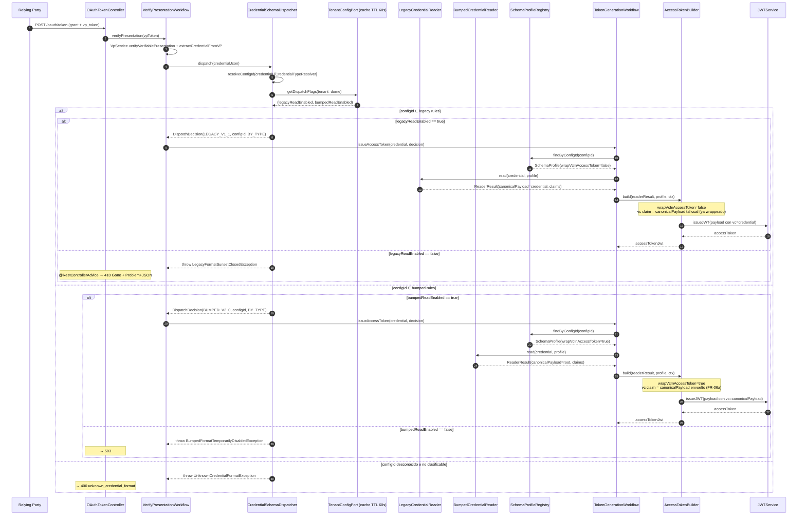

# EUDISTACK-145: US-08 Verifier dual-format read (legacy + bumpeado) — Tech Design (per-Story)

> **Naturaleza del documento — Tech Design = enriquecimiento técnico per-Story.**
>
> Este documento es el **resultado del comando `/enrich-us EUDISTACK-145`** (parte técnica). La propuesta funcional vive en [`user-story.md`](user-story.md); los AC canónicos viven en [`acceptance-criteria.md`](acceptance-criteria.md). La §2 de este documento es un **mirror sintético**, no el canónico.
>
> Refina el slice Verifier del feature design (`architecture.md` §3.3 + AD-3 + §6.2 + §9.4) sin duplicarlo.
>
> **Reglas:** lo común no se duplica. §3.6 (AC↔tasks) y §4.1 (resumen tasks) los rellena `task-planner` tras generar `tasks.md`.

## 1. Referencias

| Campo | Valor |
|-------|-------|
| Status | **Draft** |
| Date | 2026-05-19 |
| Story Jira | [`EUDISTACK-145`](https://eudistack.atlassian.net/browse/EUDISTACK-145) |
| Feature parent | [`EUDISTACK-12`](https://eudistack.atlassian.net/browse/EUDISTACK-12) — DOME — Standalone-to-SaaS Tenant Migration |
| Feature architecture | [`../specs/architecture.md`](../specs/architecture.md) — §3.3 (Verifier C3), AD-3 (dispatcher + wrap), §6.2 (sequence), §9.4 (feature flags) |
| Feature SRS | [`../specs/srs.md`](../specs/srs.md) — FR-04, FR-05, FR-06a, FR-06b, NFR-02 |
| Story functional spec | [`user-story.md`](user-story.md) |
| Story acceptance criteria (canonical) | [`acceptance-criteria.md`](acceptance-criteria.md) |
| User story (feature-level) | [`../specs/user-stories.md`](../specs/user-stories.md) — `US-08` |
| Target repo(s) | `eudistack-core-verifier` |
| Branch sugerida | `feature/EUDISTACK-145-verifier-dual-format-read` |
| Tech architect | software-architect (Stage 2b) |
| Tasks file | [`tasks.md`](tasks.md) |
| Normative refs | [OID4VP 1.0 §6 / §11](https://openid.net/specs/openid-4-verifiable-presentations-1_0.html) · [W3C VCDM v2.0 §4 / §5.1 `@context`](https://www.w3.org/TR/vc-data-model-2.0/) · [W3C VCDM v1.1](https://www.w3.org/TR/vc-data-model/) · [RFC 9457 Problem Details](https://www.rfc-editor.org/rfc/rfc9457) (para forma de error) |

> **Nota.** La propuesta funcional ha sido movida a [`user-story.md`](user-story.md); los AC canónicos a [`acceptance-criteria.md`](acceptance-criteria.md). Este documento empieza en §2 (mirror sintético).

---

## §2 — Requisitos y escenarios (mirror sintético)

> **Fuente de verdad: [`acceptance-criteria.md`](acceptance-criteria.md).** Esta sección es un mirror compacto pensado para que `task-planner` y `fullstack-developer` localicen rápidamente los AC sin abrir el archivo canónico. Numeración estable: misma que en `acceptance-criteria.md`.

### 2.1 Mirror de Acceptance criteria

| ID | Nombre corto | Tipo | Trace SRS | Fuente |
|----|--------------|------|-----------|--------|
| AC-01 | Happy path legacy (RP allowlist, Employee `.3`) | happy path | FR-04 + NFR-02 | [`acceptance-criteria.md#ac-01--happy-path-lectura-legacy-rp-allowlist-employee-3`](acceptance-criteria.md) |
| AC-02 | Happy path bumpeado (RP allowlist, Employee `.4` v2.0) | happy path | FR-04 + FR-06a | [`acceptance-criteria.md#ac-02--happy-path-lectura-bumpeada-rp-allowlist-employee-4-vcdm-v20`](acceptance-criteria.md) |
| AC-03 | Cobertura 3 tipos en legacy | happy path | FR-04 | [`acceptance-criteria.md#ac-03--cobertura-de-los-tres-tipos-productivos-en-variante-legacy`](acceptance-criteria.md) |
| AC-04 | Cobertura 3 tipos en bumpeado | happy path | FR-04 + FR-05 + FR-06a | [`acceptance-criteria.md#ac-04--cobertura-de-los-tres-tipos-productivos-en-variante-bumpeada`](acceptance-criteria.md) |
| AC-05 | M2M con Machine legacy | happy path | FR-04 + NFR-02 | [`acceptance-criteria.md#ac-05--máquina-sin-registro-m2m-client_credentials-con-credencial-machine-legacy`](acceptance-criteria.md) |
| AC-06 | M2M con Machine bumpeada | happy path | FR-04 + FR-06a | [`acceptance-criteria.md#ac-06--máquina-sin-registro-con-credencial-machine-bumpeada`](acceptance-criteria.md) |
| AC-07 | Cierre del sunset legacy (flag OFF sin redeploy) | happy path | FR-04 (sunset) + NFR-04 | [`acceptance-criteria.md#ac-07--cierre-del-sunset-legacy-flag-off-por-configuración-sin-redeploy`](acceptance-criteria.md) |
| AC-08 | Defaults de los flags al desplegar | happy path | FR-04 | [`acceptance-criteria.md#ac-08--defaults-de-los-flags-al-desplegar-la-story`](acceptance-criteria.md) |
| AC-09 | Indistinguibilidad estructural Access Token | happy path | NFR-02 + FR-06a | [`acceptance-criteria.md#ac-09--indistinguibilidad-estructural-access-token-legacy-vs-bumpeado`](acceptance-criteria.md) |
| AC-10 | Activación independiente de flags | happy path | FR-04 | [`acceptance-criteria.md#ac-10--activación-independiente-de-los-dos-flags-bumped_read-on-legacy_read-off`](acceptance-criteria.md) |
| EC-01 | `@context` con v1.1+v2.0 mezcladas | edge case | FR-04 | [`acceptance-criteria.md#ec-01--credencial-con-context-que-contiene-tanto-vcdm-v11-como-v20-mezcla`](acceptance-criteria.md) |
| EC-02 | `@context` sin URLs VCDM conocidas | edge case | FR-04 | [`acceptance-criteria.md#ec-02--context-que-no-contiene-ninguna-url-canónica-vcdm-conocida`](acceptance-criteria.md) |
| EC-03 | `type[]` con orden no canónico | edge case | FR-04 | [`acceptance-criteria.md#ec-03--type-con-orden-no-canónico-genéricos-al-final`](acceptance-criteria.md) |
| EC-04 | Flag toggleado entre peticiones | edge case | FR-04 | [`acceptance-criteria.md#ec-04--sunset-flag-toggleado-entre-dos-peticiones-consecutivas`](acceptance-criteria.md) |
| EC-05 | Allowlist preserva semántica pre-migración | edge case | FR-04 | [`acceptance-criteria.md#ec-05--allowlist-preserva-su-semántica-pre-migración`](acceptance-criteria.md) |
| EC-06 | M2M bumpeado declara `client_credentials` en `grantEligibility` | edge case | FR-04 | [`acceptance-criteria.md#ec-06--máquina-sin-registro-schema-bumpeado-debe-declarar-client_credentials-en-granteligibility`](acceptance-criteria.md) |
| EC-07 | Schema bumpeado sin profile cargado | edge case | FR-04 | [`acceptance-criteria.md#ec-07--schema-bumpeado-emite-registro-de-profile-que-el-verifier-todavía-no-tiene-cargado`](acceptance-criteria.md) |
| ES-01 | `@context` ausente / no array | error scenario | FR-04 + NFR-02 | [`acceptance-criteria.md#es-01--input-inválido-context-ausente-o-no-es-array`](acceptance-criteria.md) |
| ES-02 | `type[]` solo genéricos y sin `vct` | error scenario | FR-04 | [`acceptance-criteria.md#es-02--input-inválido-type-solo-contiene-genéricos-verifiablecredential-sin-config-id`](acceptance-criteria.md) |
| ES-03 | `credential_configuration_id` desconocido | error scenario | FR-04 | [`acceptance-criteria.md#es-03--recurso-ausente-credential_configuration_id-desconocido-formato-no-clasificable`](acceptance-criteria.md) |
| ES-04 | Sunset cerrado + credencial legacy | error scenario | FR-04 + NFR-04 | [`acceptance-criteria.md#es-04--conflicto-de-estado-flag-legacy_read-false-y-credencial-legacy-presentada`](acceptance-criteria.md) |
| ES-05 | `bumped_read=false` + credencial bumpeada | error scenario | FR-04 | [`acceptance-criteria.md#es-05--conflicto-de-estado-flag-bumped_read-false-y-credencial-bumpeada-presentada`](acceptance-criteria.md) |
| ES-06 | Refresh caché config falla (DB caída) | error scenario | FR-04 + NFR-02 | [`acceptance-criteria.md#es-06--fallo-de-dependencia-externa-refresh-de-caché-de-tenant_dome_config-falla-db-no-responde`](acceptance-criteria.md) |
| ES-07 | Timeout JWKS Issuer | error scenario | FR-04 + NFR-02 | [`acceptance-criteria.md#es-07--timeout-en-validación-de-firma-de-credencial-downstream-jwks-lento`](acceptance-criteria.md) |
| ES-08 | Reader lanza excepción inesperada | error scenario | FR-04 + AD-3 | [`acceptance-criteria.md#es-08--fail-secure-ante-bumpedcredentialreader-lanzando-excepción-inesperada`](acceptance-criteria.md) |

### 2.2 Notas técnicas sobre edge cases / error scenarios

> Solo apuntes técnicos de implementación (no redefinir el escenario — eso vive en `acceptance-criteria.md`).

| ID | Implementación relevante |
|----|--------------------------|
| EC-01 | El dispatcher usa **prioridad `type[]` sobre `@context`**: si `CredentialTypeResolver.resolveConfigId(credential)` devuelve un config-id mapeable (legacy o bumped), se decide por ahí. `@context` solo es fallback cuando `type[]` no discrimina. Implementar como `DispatchDecision` con campo `reason ∈ { BY_TYPE, BY_CONTEXT, UNCLASSIFIABLE }` para auditoría. |
| EC-02 | Mismo path que EC-01 — el dispatcher no exige presencia de la URL VCDM en `@context` si `type[]` discrimina. Log `dispatch_reason=BY_TYPE, no_vcdm_context_url=true`. |
| EC-03 | Reusar `CredentialTypeResolver` ya existente (`verifier/domain/util/CredentialTypeResolver.java`) — filtra `VerifiableCredential` y `VerifiableAttestation` y devuelve el primer no-genérico. **No reimplementar**. |
| EC-04 | Apoyarse en el TTL bounded ya existente de `TenantConfigPort` (cache spec en architecture.md §9.4: TTL ≤ 60s). No introducir invalidación ad-hoc — añade complejidad. El test de integración valida que el toggle se observa en ≤ TTL+5s (NFR-S-145-03). |
| EC-05 | **No tocar** `ClientRegistryProvider` ni `LocalClientRegistryProvider` ni `DelegatingRegisteredClientRepository`. Allowlist se preserva por inacción — añadir test que documenta el contrato preservado. |
| EC-06 | Verificar en seed M-4 de `architecture.md` que los JSON Schemas bumpeados (`learcredential.machine.w3c.3`) declaran `grant_eligibility: ["client_credentials", ...]` igual que sus equivalentes legacy. Si el seed se carga desde `eudistack-platform-assets`, validar este aspecto en un test de regression. |
| EC-07 | `BumpedCredentialReader` debe invocar `SchemaProfileRegistry.findByConfigId(configId)` y, ante `Optional.empty()`, lanzar `InvalidCredentialTypeException` mapeada a `400`. **No degradar** a `LegacyCredentialReader` (rompe AD-3). |
| ES-01 | Reusar la validación de `VpServiceImpl.extractContextFromJson` (ya devuelve OAuth2Error con `invalid_request`). No duplicar. |
| ES-02 | Reusar `CredentialTypeResolver.resolveConfigId` que ya lanza `InvalidCredentialTypeException`. |
| ES-03 | `CredentialSchemaDispatcher` debe distinguir "config-id desconocido" (ES-03 → 400 `unknown_credential_format`) de "config-id conocido pero formato no clasificable" (ES-02 → 400 `invalid_request`). |
| ES-04 | El error de sunset cerrado se modela como `LegacyFormatSunsetClosedException` mapeada por `@RestControllerAdvice` a `410 Gone` con `Content-Type: application/problem+json` (RFC 9457). |
| ES-05 | Similar a ES-04 pero con `BumpedFormatTemporarilyDisabledException` → `503` + retry-able. |
| ES-06 | Stale-while-error es comportamiento del `TenantConfigPort` ya existente (verificar implementación actual; si no lo soporta, abrir Story de mejora — fuera de scope de US-08). Esta Story solo añade tests que cubren el comportamiento esperado. |
| ES-07 | Timeout del cliente JWKS está cubierto en el `JWTService` existente. Esta Story no introduce nuevos clientes downstream — sólo verifica que el path actual responde `503` correctamente. |
| ES-08 | Rodear la llamada al reader con un `try/catch (RuntimeException)` que registra y devuelve `400 invalid_request`. **NO** caer en cascada al otro reader (AD-3 opción B explícitamente descartada). |

### 2.3 Test matrix (referencia)

> Canónica en [`acceptance-criteria.md#5-test-matrix`](acceptance-criteria.md). Aquí solo el resumen.

| Capa | Tests representativos | Naming Java |
|------|------------------------|-------------|
| Unit (Dispatcher determinista) | EC-01, EC-02, EC-03, ES-01, ES-02, ES-03, ES-08 | `CredentialSchemaDispatcherTest.java` |
| Integration (MockMvc + flow completo) | AC-01..AC-10, EC-04..EC-07, ES-04..ES-07 | `*IT.java` bajo `src/test/java/.../verifier/dual-format/` |
| Performance (k6) | NFR-S-145-01 | `perf/verifier-dual-format-overhead.js` |

### 2.4 NFRs específicos de la Story

> Canónicos en [`acceptance-criteria.md#4-non-functional-requirements-story-specific`](acceptance-criteria.md).

| NFR | Métrica | Umbral | Cómo se valida |
|-----|---------|--------|----------------|
| NFR-S-145-01 | `dome_verifier_dispatcher_duration_ms` p95 | < 50 ms | k6 micro-benchmark |
| NFR-S-145-02 | `dome_verifier_dispatcher_total{decision="deny", reason="unclassifiable"} / total` | < 0.1% | Dashboard cutover (observabilidad continua) |
| NFR-S-145-03 | Latencia desde `UPDATE tenant_dome_config` hasta observar `410 Gone` | ≤ TTL+5s (≤ 65s) | Integration test config-driven |

---

## §3 — Diseño técnico y decisiones de arquitectura

### 3.1 Qué cambia respecto al `architecture.md`

Implementa el slice Verifier definido en `architecture.md` §3.3, AD-3 y §6.2 dentro de `eudistack-core-verifier`. Concretamente: introduce el `CredentialSchemaDispatcher` (domain service determinista por `@context` + `type[]`), los dos readers `LegacyCredentialReader` y `BumpedCredentialReader`, y aísla el wrap `vc` en un `AccessTokenBuilder` (sustituye/refactoriza el wrap implícito que hoy hace `TokenGenerationWorkflow` al añadir el VC al `id_token` y derivar `credential_type`).

No introduce APIs nuevas hacia las RPs; no toca `ClientRegistryProvider`, `TrustFrameworkService`, `CredentialStatusVerifier` ni `VpServiceImpl` (allowlist + admisión de máquinas sin registro **preservadas por inacción**, EC-05).

### 3.2 Archivos / módulos afectados

> Convención: paquetes existentes en `es.in2.vcverifier.verifier.*` (Verifier bounded context — package-by-feature dentro de hexagonal). Nuevos archivos en negrita.

| Capa | Bounded context / módulo | Path | Cambios |
|------|--------------------------|------|---------|
| Domain (model) | verifier | `src/main/java/es/in2/vcverifier/verifier/domain/model/dispatch/DispatchDecision.java` | **NEW** — record `(CredentialFormat format, String configId, DispatchReason reason)`; sealed enum `CredentialFormat { LEGACY_V1_1, BUMPED_V2_0 }`; sealed enum `DispatchReason { BY_TYPE, BY_CONTEXT, BY_TYPE_NO_VCDM_CONTEXT }`. |
| Domain (model) | verifier | `src/main/java/es/in2/vcverifier/verifier/domain/model/dispatch/DispatchRule.java` | **NEW** — record con `(String configId, CredentialFormat format)`; representa una fila del catálogo de configs reconocidos. |
| Domain (model) | verifier | `src/main/java/es/in2/vcverifier/verifier/domain/model/validation/SchemaProfile.java` | MODIFIED — añadir campo opcional `boolean wrapVcInAccessToken` (default `false`). Para profiles bumpeados v2.0 cargados desde S3 vendrá `true`; para legacy `false`. Mantiene compatibilidad con profiles existentes vía default. |
| Domain (service) | verifier | `src/main/java/es/in2/vcverifier/verifier/domain/service/CredentialSchemaDispatcher.java` | **NEW** — port (interface) con `DispatchDecision dispatch(JsonNode credential)`. |
| Domain (service) | verifier | `src/main/java/es/in2/vcverifier/verifier/domain/service/CredentialReader.java` | **NEW** — port (SPI) con `boolean supports(CredentialFormat format)` + `ReaderResult read(JsonNode credential, SchemaProfile profile)`. `ReaderResult` es un record con `(JsonNode canonicalPayload, ExtractedClaims extractedClaims)`. |
| Domain (service) | verifier | `src/main/java/es/in2/vcverifier/verifier/domain/service/AccessTokenBuilder.java` | **NEW** — port (domain service) con `String build(ReaderResult readerResult, SchemaProfile profile, BuildContext ctx)`. Encapsula la construcción del Access Token incluyendo el wrap `vc` condicional. |
| Domain (model) | verifier | `src/main/java/es/in2/vcverifier/verifier/domain/model/tokens/BuildContext.java` | **NEW** — record con `(String audience, String tenant, Instant issueTime, Instant expiry, String scope)`. |
| Domain (exception) | verifier | `src/main/java/es/in2/vcverifier/verifier/domain/exception/LegacyFormatSunsetClosedException.java` | **NEW** — extends RuntimeException; mapped a 410. |
| Domain (exception) | verifier | `src/main/java/es/in2/vcverifier/verifier/domain/exception/BumpedFormatTemporarilyDisabledException.java` | **NEW** — extends RuntimeException; mapped a 503. |
| Domain (exception) | verifier | `src/main/java/es/in2/vcverifier/verifier/domain/exception/UnknownCredentialFormatException.java` | **NEW** — extends RuntimeException; mapped a 400 `unknown_credential_format`. |
| Application | verifier | `src/main/java/es/in2/vcverifier/verifier/application/workflow/VerifyPresentationWorkflow.java` | MODIFIED — invoca el dispatcher después de extraer la credencial del VP; pasa la `DispatchDecision` a la siguiente capa (workflow oauth2). |
| Application | oauth2 | `src/main/java/es/in2/vcverifier/oauth2/application/workflow/TokenGenerationWorkflow.java` | MODIFIED — delega construcción del Access Token a `AccessTokenBuilder`. Se mantiene la generación del id_token aquí (no es parte de esta Story). |
| Application | oauth2 | `src/main/java/es/in2/vcverifier/oauth2/application/workflow/ClientCredentialsValidationWorkflow.java` | MODIFIED (mínimo) — tras extraer el `vc`, invocar el dispatcher para enriquecer logs/metrics. No cambia la lógica de `grantEligibility`. |
| Infrastructure (adapter) | verifier | `src/main/java/es/in2/vcverifier/verifier/infrastructure/adapter/dispatch/ContextAndTypeCredentialSchemaDispatcher.java` | **NEW** — implementación del `CredentialSchemaDispatcher`. Lee dos flags `verifier.dome.legacy_read.enabled` + `verifier.dome.bumped_read.enabled` desde `TenantConfigPort`. |
| Infrastructure (adapter) | verifier | `src/main/java/es/in2/vcverifier/verifier/infrastructure/adapter/dispatch/LegacyCredentialReader.java` | **NEW** — implementa `CredentialReader` para `LEGACY_V1_1`. La credencial legacy ya viene wrappeada en `vc` (extraída por `JWTService.extractVCFromPayload`); el reader produce `ReaderResult.canonicalPayload = vcPayload` (sin modificar) y delega extracción de claims al `ClaimsExtractor` existente. |
| Infrastructure (adapter) | verifier | `src/main/java/es/in2/vcverifier/verifier/infrastructure/adapter/dispatch/BumpedCredentialReader.java` | **NEW** — implementa `CredentialReader` para `BUMPED_V2_0`. La credencial v2.0 viene como payload raíz (sin `vc`); el reader produce `ReaderResult.canonicalPayload = root` y marca `wrapInToken=true` mediante el `SchemaProfile`. |
| Infrastructure (adapter) | verifier | `src/main/java/es/in2/vcverifier/verifier/infrastructure/adapter/tokens/JwsAccessTokenBuilder.java` | **NEW** — implementación de `AccessTokenBuilder`. Construye el JWT del Access Token aplicando el wrap `vc` cuando `profile.wrapVcInAccessToken() == true`. Reusa `JWTService.issueJWT`. |
| Infrastructure (config) | verifier | `src/main/java/es/in2/vcverifier/verifier/infrastructure/config/DispatchConfiguration.java` | **NEW** — `@Configuration` que registra el catálogo `List<DispatchRule>` desde `application.yaml` (claves `verifier.dispatch.rules.legacy`, `verifier.dispatch.rules.bumped`). Permite añadir/quitar config-ids sin recompilar — usable también por otros tenants en el futuro. |
| Infrastructure (config) | verifier | `src/main/java/es/in2/vcverifier/shared/config/properties/DispatchProperties.java` | **NEW** — `@ConfigurationProperties("verifier.dispatch")` con listas `legacy` y `bumped` de config-ids. |
| Infrastructure (config) | verifier | `src/main/java/es/in2/vcverifier/shared/config/properties/TenantDomeConfigProperties.java` | MODIFIED si existe — añadir flags `legacyReadEnabled`, `bumpedReadEnabled`. Si la lectura es vía `TenantConfigPort` runtime DB-driven, los properties solo aportan defaults locales para desarrollo. |
| Infrastructure (controller advice) | shared | `src/main/java/es/in2/vcverifier/shared/domain/exception/handler/DomeDispatchExceptionHandler.java` | **NEW** — `@RestControllerAdvice` para mapear las 3 nuevas excepciones a Problem+JSON (RFC 9457). |
| Infrastructure (config) | verifier | `src/main/resources/application.yaml` | MODIFIED — añadir sección `verifier.dispatch.rules.legacy/bumped` con la lista de config-ids DOME productivos. Defaults locales: ambos flags `true`. |
| Test (unit) | verifier | `src/test/java/es/in2/vcverifier/verifier/domain/service/CredentialSchemaDispatcherTest.java` | **NEW** — cobre EC-01, EC-02, EC-03, ES-01, ES-02, ES-03, ES-08. |
| Test (unit) | verifier | `src/test/java/es/in2/vcverifier/verifier/infrastructure/adapter/dispatch/LegacyCredentialReaderTest.java` | **NEW** |
| Test (unit) | verifier | `src/test/java/es/in2/vcverifier/verifier/infrastructure/adapter/dispatch/BumpedCredentialReaderTest.java` | **NEW** |
| Test (unit) | verifier | `src/test/java/es/in2/vcverifier/verifier/infrastructure/adapter/tokens/JwsAccessTokenBuilderTest.java` | **NEW** — cubre AC-09 con snapshot de Access Token. |
| Test (integration) | verifier | `src/test/java/es/in2/vcverifier/verifier/dualformat/LegacyEmployeeDispatchIT.java` | **NEW** — AC-01 |
| Test (integration) | verifier | `src/test/java/es/in2/vcverifier/verifier/dualformat/BumpedEmployeeDispatchIT.java` | **NEW** — AC-02 |
| Test (integration) | verifier | `src/test/java/es/in2/vcverifier/verifier/dualformat/LegacyAllTypesDispatchIT.java` | **NEW** — AC-03 (parametrizado) |
| Test (integration) | verifier | `src/test/java/es/in2/vcverifier/verifier/dualformat/BumpedAllTypesDispatchIT.java` | **NEW** — AC-04 (parametrizado) |
| Test (integration) | verifier | `src/test/java/es/in2/vcverifier/verifier/dualformat/MachineLegacyClientCredentialsIT.java` | **NEW** — AC-05 |
| Test (integration) | verifier | `src/test/java/es/in2/vcverifier/verifier/dualformat/MachineBumpedClientCredentialsIT.java` | **NEW** — AC-06 |
| Test (integration) | verifier | `src/test/java/es/in2/vcverifier/verifier/dualformat/SunsetClosedIT.java` | **NEW** — AC-07 + ES-04 |
| Test (integration) | verifier | `src/test/java/es/in2/vcverifier/verifier/dualformat/BumpedDisabledIT.java` | **NEW** — ES-05 |
| Test (integration) | verifier | `src/test/java/es/in2/vcverifier/verifier/dualformat/TenantConfigCacheRefreshIT.java` | **NEW** — AC-08 + EC-04 + ES-06 + NFR-S-145-03 |
| Test (integration) | verifier | `src/test/java/es/in2/vcverifier/verifier/dualformat/AllowlistPreservationIT.java` | **NEW** — EC-05 |
| Test (integration) | verifier | `src/test/java/es/in2/vcverifier/verifier/dualformat/SchemaProfileGrantEligibilityBumpedIT.java` | **NEW** — EC-06 |
| Test (integration) | verifier | `src/test/java/es/in2/vcverifier/verifier/dualformat/CredentialSchemaDispatcherIT.java` | **NEW** — EC-07 (missing profile fails secure) |
| Test (integration) | verifier | `src/test/java/es/in2/vcverifier/verifier/dualformat/JwksTimeoutFailureIT.java` | **NEW** — ES-07 |
| Test (integration) | verifier | `src/test/java/es/in2/vcverifier/verifier/dualformat/AccessTokenStructureParityIT.java` | **NEW** — AC-09 |
| Test (integration) | verifier | `src/test/java/es/in2/vcverifier/verifier/dualformat/LegacyOffBumpedOnIT.java` | **NEW** — AC-10 |
| Test (fixtures) | verifier | `src/test/resources/fixtures/dome/*.json` + `DomeCredentialFixtureFactory.java` | **NEW** — generación on-the-fly de credenciales sintéticas firmadas (Nimbus JOSE) para evitar drift. |
| Perf | verifier | `perf/verifier-dual-format-overhead.js` | **NEW** — k6 NFR-S-145-01 (opcional; mínimo viable un test JMH local). |

### 3.3 Ports / adapters / contratos consumidos

> Qué ports/adapters del `architecture.md` se crean, extienden o consumen en esta Story.

| Port / Contract | Ubicación | Acción | Notas |
|-----------------|-----------|--------|-------|
| `CredentialSchemaDispatcher` | domain del Verifier (architecture.md §3.3, §5.3) | **Implemented** | Implementación `ContextAndTypeCredentialSchemaDispatcher` en infrastructure. Sigue **Strategy** pattern. |
| `CredentialReader` (SPI) | domain del Verifier (NEW) | **Implemented** (2 impls) | `LegacyCredentialReader` + `BumpedCredentialReader`. **Strategy + Chain (sin caída)**: el dispatcher selecciona explícitamente; no hay `Chain of Responsibility` fallback (AD-3). |
| `AccessTokenBuilder` | domain del Verifier (architecture.md §3.3, §5.3) | **Implemented** | `JwsAccessTokenBuilder` aísla el wrap `vc` condicional (SRP — antes mezclado en `TokenGenerationWorkflow`). |
| `SchemaProfile` | domain del Verifier (existente) | **Modified** | Añade campo `wrapVcInAccessToken` (default false → no rompe profiles existentes). |
| `SchemaProfileRegistry` | domain del Verifier (existente) | **Consumed** | Se reusa para resolver profiles a partir del config-id detectado por el dispatcher. |
| `TenantConfigPort` | domain del Issuer/Verifier (architecture.md §5.3) | **Consumed** | Se lee desde aquí `verifier.dome.legacy_read.enabled` + `verifier.dome.bumped_read.enabled` con caché bounded TTL ≤ 60s. Si el `TenantConfigPort` no expone aún estos campos en `tenant_dome_config`, se añaden en la migración M-3 (referenciada en architecture.md §4.2). |
| `JWTService` (`extractVCFromPayload`, `issueJWT`) | shared (existente) | **Consumed** | Sin cambios. Ya soporta detección VCDM v1.1 vs v2.0 al extraer payload (ver `JWTServiceImpl#extractVCFromPayload` líneas 124–133). |
| `ClaimsExtractor` + `SchemaProfileClaimsExtractor` | adapter (existente) | **Consumed** | Sin cambios. El `BumpedCredentialReader` invoca el mismo `ClaimsExtractor` que el `LegacyCredentialReader`; el wrap es decisión exclusiva del `AccessTokenBuilder`. |
| `ClientRegistryProvider` + `DelegatingRegisteredClientRepository` | adapter (existente) | **NOT touched** | Allowlist preservado por inacción. EC-05 documenta el contrato. |
| `VpService` | domain (existente) | **NOT touched** | Verificación VP + holder binding inalterada. |
| `CredentialStatusVerifier` + `TrustFrameworkService` + `CredentialValidator` | domain (existente) | **NOT touched** | Validación de schema, estado y trust framework inalteradas en esta Story. |
| `ContractError handler` (`@RestControllerAdvice`) | shared infra | **Extended** | Nuevo handler `DomeDispatchExceptionHandler` mapea las 3 excepciones nuevas a Problem+JSON (RFC 9457). |

### 3.4 Flujo principal Story-specific (Mermaid)

### 3.5 Decisiones de diseño Story-specific (ADR-lite)

#### AD-145-1 — Discriminación dispatcher por `type[]` con `@context` como fallback

- **Contexto:** `architecture.md` AD-3 elige determinismo "por `@context` + `type[]`" sin precisar prioridad. EC-01 obliga a decidir si una credencial con `@context` mixto y `type` discriminante va a legacy o bumped.
- **Opciones consideradas:**
  - **A) `type[]` primario, `@context` secundario.** El config-id en `type[]` ya identifica unívocamente el schema (legacy o bumpeado) — es la información de mayor precisión. `@context` solo se consulta cuando `type[]` no discrimina (improbable en credenciales DOME productivas).
  - **B) `@context` primario, `type[]` secundario.** Lo natural según VCDM (el `@context` define la semántica), pero introduce ambigüedad cuando un emisor incluye AMBAS URLs canónicas en `@context` (caso real en migraciones).
  - **C) Combinación con score (heurística).** Sobre-ingeniería. Difícil de auditar y de testar.
- **Decisión:** **A) `type[]` primario, `@context` secundario.** El `CredentialTypeResolver` existente ya filtra genéricos y devuelve el config-id; sobre ese, una tabla `DispatchRule` registra `(configId → format)`. `@context` solo es fallback (que en la práctica no se dispara para DOME).
- **Razón:** **KISS + determinismo + reuso de código existente**. Audit-friendly (`dispatch_reason=BY_TYPE` queda en log). Cubre EC-01, EC-02, EC-03 sin ramificaciones.
- **Consecuencias:** (+) test unit trivial; (+) Audit-trail explícito por config-id. (–) Si un emisor desconocido emite con `type[]` no DOME, el dispatcher cae a `UnknownCredentialFormatException` — comportamiento correcto (fail-secure ES-03).

#### AD-145-2 — Catálogo de `DispatchRule` en configuración, no hardcoded

- **Contexto:** la lista de config-ids legacy y bumpeados crecerá si DOME bumpea más cred-types o si otros tenants en el futuro reutilizan el dispatcher. Hardcodear en Java rompería el principio de extensibilidad por configuración.
- **Opciones consideradas:**
  - **A) `application.yaml` con listas `verifier.dispatch.rules.legacy/bumped`.** Inspectable; cambiable por entorno; integrable con `@ConfigurationProperties`.
  - **B) Tabla en `tenant_dome_config` (DB-driven).** Permite hot-reload por config; encaja con cómo se gobiernan los flags. Pero el catálogo de config-ids es estructura, no parámetro de runtime — y cambiarlo en caliente es un riesgo (puede dejar fuera de cobertura una credencial productiva).
  - **C) Anotación o registry programático en `@PostConstruct`.** Acopla a Java; difícil de auditar.
- **Decisión:** **A) `application.yaml`** con `@ConfigurationProperties("verifier.dispatch")`. Default values con los 6 config-ids DOME productivos. Override por entorno mediante Spring config (`application-stg.yaml`, etc.).
- **Razón:** ENS auditable, GitOps-friendly, no rompe Spring conventions. Los flags ON/OFF sí van a `tenant_dome_config` (cambiables en caliente), pero el catálogo es estable.
- **Consecuencias:** (+) extensible para futuros tenants sin tocar código del dispatcher; (–) añadir un config-id nuevo requiere deploy de config (no de código), aceptable.

#### AD-145-3 — `wrapVcInAccessToken` como campo del `SchemaProfile`, no de `DispatchDecision`

- **Contexto:** FR-06a manda envolver bajo `vc` solo para VCDM v2.0. La decisión "wrap o no" se puede modelar como propiedad del **formato** (`CredentialFormat.BUMPED_V2_0 → siempre wrap`) o del **profile** (campo en `SchemaProfile`).
- **Opciones consideradas:**
  - **A) Campo `wrapVcInAccessToken` en `SchemaProfile`.** Permite gobernarlo por config (el JSON Schema en `eudistack-platform-assets` lleva la metadata). Alinea con dependencia EUDISTACK-473 (D-2: profile-per-tenant) — cuando llegue, la propiedad es per-profile per-tenant nativa, sin código a refactorizar.
  - **B) `CredentialFormat` con propiedad fija `boolean wrap`.** Más simple. Pero si un futuro requisito exige "credenciales v1.1 también con wrap construido" o "v2.0 sin wrap en algún flujo de pruebas", obligaría a refactorizar.
- **Decisión:** **A) Campo en `SchemaProfile`.** Para legacy (v1.1) los profiles cargados tendrán `wrapVcInAccessToken=false` (la credencial ya lo trae); para bumpeados (v2.0) `true`. Cumple FR-06a + FR-06b sin acoplar al formato.
- **Razón:** **OCP** (cambios futuros sin tocar el dominio del dispatcher) + alineación con D-2 (EUDISTACK-473). Auditable en los JSON Schemas.
- **Consecuencias:** (+) flexible; (+) sigue **SRP** porque el wrap es comportamiento del Access Token, no del formato; (–) requiere que el seed M-4 escriba correctamente `wrapVcInAccessToken=true` en los profiles bumpeados — cubierto por EC-06 y un test de regression.

#### AD-145-4 — No degradar a try/catch en cascada entre readers (fail-secure)

- **Contexto:** ES-08 detalla el caso "el `BumpedCredentialReader` lanza excepción inesperada". La tentación es atrapar y caer al `LegacyCredentialReader`. AD-3 lo descarta explícitamente.
- **Decisión:** Una excepción en el reader seleccionado por el dispatcher se traduce a `400 invalid_request` sin reintentar con el otro reader.
- **Razón:** El dispatcher es **determinista**; un fallback implícito convertiría try/catch en control de flujo (anti-pattern en AD-3 opción B descartada) y abriría una ventana de oracle attack ("¿es legacy o bumped?" se podría inferir del tiempo de respuesta). Fail-secure.
- **Consecuencias:** (+) seguridad; (+) test unit más sencillo. (–) Si un cliente envía credencial mal-formada en formato bumpeado, no se intenta parsear como legacy — comportamiento correcto.

#### AD-145-5 — Defaults locales en `application.yaml` distintos a defaults productivos

- **Contexto:** Para desarrollo y testing local, ambos flags deben estar `true` por defecto sin obligar a poblar `tenant_dome_config`. En producción los defaults son los mismos pero la fuente autoritativa es la DB.
- **Decisión:** Defaults en `application.yaml`: `verifier.dome.legacy_read.enabled=true`, `verifier.dome.bumped_read.enabled=true`. `TenantConfigPort` lee de DB cuando exista fila; si no existe, devuelve los defaults Spring (comportamiento ya esperado del port existente).
- **Razón:** alinea con `architecture.md` §9.4 ("Backend leídas desde `dome_issuer.tenant_dome_config` por el `TenantConfigPort` ya existente") + permite tests locales sin DB.
- **Consecuencias:** (+) DX; (–) requiere documentar en runbook (US-09) que la primera escritura a `tenant_dome_config` debe llevar los dos flags explícitos para que el cutover sea predecible.

### 3.6 Mapeo acceptance criteria → tasks

| AC | Task(s) que lo cubre(n) | Notas |
|----|-------------------------|-------|
| AC-01 | 1, 4, 6, 7, 9, 10, 11, 14, 15, 19 | Happy path legacy Employee `.3`; dispatcher + LegacyReader + AccessTokenBuilder + metrics |
| AC-02 | 1, 2, 4, 6, 8, 9, 10, 11, 14, 15, 19 | Happy path bumpeado Employee `.4`; wrap `vc` por Verifier (FR-06a) vía `JwsAccessTokenBuilder` |
| AC-03 | 1, 6, 7, 10, 11, 15, 20, 26 | Cobertura 3 tipos legacy (Employee, Machine, Label); test parametrizado + regression catálogo |
| AC-04 | 1, 2, 6, 8, 10, 11, 15, 20, 26 | Cobertura 3 tipos bumpeados; wrap `vc` + regression catálogo |
| AC-05 | 4, 6, 7, 10, 12, 15, 21 | M2M client_credentials con Machine legacy; `grantEligibility` via `SchemaProfile` existente |
| AC-06 | 2, 4, 6, 8, 9, 10, 12, 15, 21 | M2M client_credentials con Machine bumpeada; wrap `vc` aplicado por `AccessTokenBuilder` |
| AC-07 | 3, 6, 13, 14, 22 | Sunset flag OFF → 410 Gone + `LegacyFormatSunsetClosedException` + métricas audit |
| AC-08 | 5, 6, 18, 23 | Defaults flags `true` desde `application.yaml`; caché bounded TTL ≤ 60s; `FlagDefaultsTest` |
| AC-09 | 2, 4, 9, 11, 17, 24 | Indistinguibilidad estructural Access Token; snapshot test JSONAssert claims raíz |
| AC-10 | 1, 3, 5, 6, 22 | Activación independiente flags (`bumped_read=true`, `legacy_read=false`); `LegacyOffBumpedOnIT` |
| EC-01 | 4, 6, 16 | `@context` mixto: prioridad `type[]` → `CredentialSchemaDispatcherTest#mixedContextResolvedByType` |
| EC-02 | 4, 6, 16 | `@context` sin URLs VCDM: `DispatchReason.BY_TYPE_NO_VCDM_CONTEXT`; unit test |
| EC-03 | 6, 16 | `type[]` orden no canónico: `CredentialTypeResolver` existente; unit test |
| EC-04 | 6, 23 | Flag toggleado entre peticiones: TTL caché; `TenantConfigCacheRefreshIT#flagTogglesAfterTtl` |
| EC-05 | 6, 10, 25 | Allowlist preservada por inacción; `AllowlistPreservationIT` documenta el contrato |
| EC-06 | 8, 12, 21, 25 | `grantEligibility` declara `client_credentials` en SchemaProfile bumpeado; `SchemaProfileGrantEligibilityBumpedIT` |
| EC-07 | 8, 25 | Profile ausente → `InvalidCredentialTypeException` → 400 fail-secure; `CredentialSchemaDispatcherIT#bumpedWithMissingProfileFailsSecure` |
| ES-01 | 3, 6, 16 | `@context` ausente/no array → 400 `invalid_request`; unit test `CredentialSchemaDispatcherTest#missingContextRejects` |
| ES-02 | 4, 6, 16 | `type[]` solo genéricos → 400 `invalid_request`; `CredentialSchemaDispatcherTest#onlyGenericTypesRejects` |
| ES-03 | 3, 6, 13, 16 | Config-id desconocido → 400 `unknown_credential_format`; `UnknownCredentialFormatException` + handler |
| ES-04 | 3, 6, 13, 14, 22 | `legacy_read=false` + credencial legacy → 410 Gone; `SunsetClosedIT#legacyReturns410` |
| ES-05 | 3, 6, 13, 22 | `bumped_read=false` + credencial bumpeada → 503; `BumpedDisabledIT#bumpedReturns503` |
| ES-06 | 6, 23 | Refresh caché falla → stale-while-error; `TenantConfigCacheRefreshIT#staleWhileErrorReturnsCachedValue` |
| ES-07 | 10, 25 | JWKS timeout → 503; `JwksTimeoutFailureIT` (flujo existente verificado) |
| ES-08 | 4, 6, 16, 17 | Reader lanza excepción → 400 fail-secure sin cascada; unit + `CredentialSchemaDispatcherTest#readerExceptionFailsSecure` |
| NFR-S-145-01 | 14 | Overhead dispatcher p95 < 50ms; métricas `dome_verifier_dispatcher_duration_ms` + k6 opcional |
| NFR-S-145-02 | 14 | Deny rate `unclassifiable` < 0.1%; CloudWatch dashboard cutover (observabilidad continua) |
| NFR-S-145-03 | 23 | Latencia flag flip ≤ TTL+5s (65s); `TenantConfigCacheRefreshIT#flagFlipObservedWithinTtl` |

### 3.7 Riesgos / dependencias técnicas

#### 3.7.1 Dependencias con otras Stories

| Story dependencia | Tipo | Mecanismo de deploy seguro |
|-------------------|------|----------------------------|
| **US-01 (EUDISTACK-138) — Alta tenant DOME** | Recomendada para smoke E2E, **no bloqueante** para mergear esta Story | El código aterriza con flags `verifier.dome.bumped_read.enabled=true` + `verifier.dome.legacy_read.enabled=true` por defecto en `application.yaml`. Sin tenant `dome` provisionado, el dispatcher convive sin tráfico real (es lectura pasiva — solo activa si llega una credencial con config-id de la tabla `DispatchRule`). Para tenants no-DOME que emitan credenciales con otros config-ids, el dispatcher devuelve `UnknownCredentialFormatException` solo si han pasado por el VP — la práctica real es que el flujo Verifier es per-tenant (cada tenant tiene su Verifier o su configuración), y otros tenants no envían credenciales DOME al dispatcher DOME. |
| **US-09 (EUDISTACK-483) — Cutover plan** | Coordinación de activación productiva, **no bloqueante** de desarrollo | El comité enciende `legacy_read` + `bumped_read` por configuración el día del corte. Esta Story garantiza defaults sanos (ambos `true`) para que aterrice sin tocar nada. |
| **EUDISTACK-473 (D-2) — Profile-per-tenant** | Externa, **no bloqueante** | El campo `wrapVcInAccessToken` se modela en `SchemaProfile` (AD-145-3). Si EUDISTACK-473 no llega antes del Sprint 2, los profiles cargados desde `eudistack-platform-assets` traen ya el campo cumpliendo FR-06a globalmente. El flag temporal `verifier.dome.wrap_vc.enabled` (D-tech-2 en architecture.md) NO se introduce en esta Story salvo que el PM lo demande explícitamente; se deja como follow-up. |

> **Sin dependencias de negocio entre Stories.** Esta Story se desarrolla, prueba y mergea sola. Cumple INVEST.

#### 3.7.2 Riesgos Story-specific

| # | Riesgo | Probabilidad | Impacto | Mitigación |
|---|--------|--------------|---------|------------|
| R-145-1 | El refactor de `TokenGenerationWorkflow` para delegar en `AccessTokenBuilder` rompe el flujo de id_token para tenants no-DOME | Media | Alto | Mantener id_token construido en `TokenGenerationWorkflow` (no se mueve). Solo el access_token + el wrap `vc` van a `AccessTokenBuilder`. Tests de regression en `oauth2/application/workflow` con credenciales LEAR no-DOME existentes. |
| R-145-2 | El campo `wrapVcInAccessToken` en `SchemaProfile` rompe profiles cargados en STG/PROD por `LocalSchemaProfileRegistry` (no contemplan el campo) | Media | Medio | Hacer el campo `boolean` con default `false` en el record `SchemaProfile`. `LocalSchemaProfileRegistry#parseAndRegister` parsea opcionalmente `wrap_vc_in_access_token` (si ausente → `false`). Test en `LocalSchemaProfileRegistryTest` con un JSON sin el campo. |
| R-145-3 | El dispatcher introduce overhead que viola NFR-S-145-01 (p95 < 50ms) | Baja | Medio | El dispatcher es JSON tree access + lookup en `HashMap<String, CredentialFormat>` — operación O(1). k6 micro-benchmark (NFR-S-145-01) ejecutado en CI antes del merge. |
| R-145-4 | TTL de 60s en la caché de flags causa rechazos ambiguos durante el flip del Operador al cierre del sunset | Media | Bajo | Documentar en US-09 que el comité debe anunciar ventana 60s antes del flip. `audit.dome.verifier_dispatch` registra timestamps que permiten correlacionar requests durante la ventana. EC-04 valida el comportamiento. |
| R-145-5 | El `DispatchRule` catalog en `application.yaml` queda desincronizado de los JSON Schemas en `eudistack-platform-assets` (config-id en assets pero no en rules → `unknown_credential_format`) | Media | Alto | Test de regression: enumerar todos los `credential_configuration_id` declarados en los JSON Schemas DOME del classpath y verificar que cada uno está en `DispatchProperties.legacy` o `bumped`. Falla CI si hay desviación. |
| R-145-6 | El `BumpedCredentialReader` falla con credenciales v2.0 que llevan `cnf.jwk` con curva no soportada | Baja | Medio | Reusar la validación de holder binding ya existente en `VpService`; no se introducen nuevos paths de validación cripto. ES-07 + ES-08 cubren el fail-secure. |

---

## §4 — Checklist de tareas (referencia)

> Las tareas implementables viven en [`tasks.md`](tasks.md) (archivo separado generado por `task-planner` agent — el `fullstack-developer` puede actualizar status durante `/implement` sin tocar este documento).

### 4.1 Resumen de tasks

> Mirror sintético de `tasks.md`. La fuente de verdad es [`tasks.md`](tasks.md).

| # | Task | Capa | Size |
|---|------|------|------|
| 1 | Modelos de dominio del dispatcher: `DispatchDecision`, `DispatchRule`, enums `CredentialFormat`/`DispatchReason` | domain | S |
| 2 | Ampliar `SchemaProfile` con campo `wrapVcInAccessToken` (default `false`) | domain | S |
| 3 | Excepciones de dominio: `LegacyFormatSunsetClosedException`, `BumpedFormatTemporarilyDisabledException`, `UnknownCredentialFormatException` | domain | S |
| 4 | Ports de dominio: `CredentialSchemaDispatcher`, `CredentialReader` (SPI), `AccessTokenBuilder`; value objects `ReaderResult`, `BuildContext` | domain | M |
| 5 | `DispatchProperties` + `DispatchConfiguration`; actualizar `application.yaml` con catálogo y defaults de flags | infrastructure | S |
| 6 | Implementar `ContextAndTypeCredentialSchemaDispatcher` (lógica type→context, flags, excepciones) + `TenantDomeConfigProperties` | infrastructure | M |
| 7 | Implementar `LegacyCredentialReader` | infrastructure | S |
| 8 | Implementar `BumpedCredentialReader` (fail-secure ante profile ausente) | infrastructure | S |
| 9 | Implementar `JwsAccessTokenBuilder` (wrap `vc` condicional, indistinguibilidad claims raíz) | infrastructure | M |
| 10 | Modificar `VerifyPresentationWorkflow`: invocar dispatcher y propagar `DispatchDecision` | application | M |
| 11 | Modificar `TokenGenerationWorkflow`: delegar en `AccessTokenBuilder` | application | M |
| 12 | Modificar `ClientCredentialsValidationWorkflow`: enriquecer logs/métricas M2M (mínimo) | application | S |
| 13 | `DomeDispatchExceptionHandler` (`@RestControllerAdvice` → Problem+JSON RFC 9457) | infrastructure | S |
| 14 | Instrumentar métricas Micrometer: `dome_verifier_dispatcher_total`, `dome_verifier_legacy_replay_after_sunset_total`, `dome_verifier_dispatcher_duration_ms` | infrastructure | S |
| 15 | Fixtures de test: `DomeCredentialFixtureFactory` + vectores sintéticos Nimbus JOSE (6 config-ids) | test | M |
| 16 | Tests unitarios `CredentialSchemaDispatcherTest`: EC-01..EC-03, ES-01..ES-03, ES-08 (7 casos) | test | M |
| 17 | Tests unitarios `LegacyCredentialReaderTest`, `BumpedCredentialReaderTest`, `JwsAccessTokenBuilderTest` | test | M |
| 18 | Test unitario `FlagDefaultsTest`: defaults `DispatchProperties` desde `application.yaml` (AC-08) | test | S |
| 19 | Integration tests happy path Employee: `LegacyEmployeeDispatchIT` (AC-01) + `BumpedEmployeeDispatchIT` (AC-02) | test | M |
| 20 | Integration tests 3 tipos productivos: `LegacyAllTypesDispatchIT` (AC-03) + `BumpedAllTypesDispatchIT` (AC-04) | test | M |
| 21 | Integration tests M2M: `MachineLegacyClientCredentialsIT` (AC-05) + `MachineBumpedClientCredentialsIT` (AC-06) | test | M |
| 22 | Integration tests sunset y flags: `SunsetClosedIT` (AC-07+ES-04) + `LegacyOffBumpedOnIT` (AC-10) + `BumpedDisabledIT` (ES-05) | test | M |
| 23 | Integration test caché TTL: `TenantConfigCacheRefreshIT` (AC-08 + EC-04 + ES-06 + NFR-S-145-03) | test | M |
| 24 | Integration test paridad Access Token: `AccessTokenStructureParityIT` (AC-09, snapshot JSONAssert) | test | S |
| 25 | Integration tests allowlist + SchemaProfile + JWKS: `AllowlistPreservationIT` (EC-05) + `SchemaProfileGrantEligibilityBumpedIT` (EC-06) + `CredentialSchemaDispatcherIT` (EC-07) + `JwksTimeoutFailureIT` (ES-07) | test | M |
| 26 | Test regression catálogo: `DispatchRuleCatalogConsistencyTest` — falla CI si config-id en assets no está en `DispatchProperties` (R-145-5) | test | S |

**Totales:** 26 tareas de implementación + 5 closing (C1–C5) = **31 tareas**.

| Size | Tareas implementación | Estimación orientativa |
|------|-----------------------|------------------------|
| S (×13) | 1, 2, 3, 5, 7, 8, 12, 13, 14, 18, 24, 26, C1–C5 | ~2–4 h cada una |
| M (×13) | 4, 6, 9, 10, 11, 15, 16, 17, 19, 20, 21, 22, 23, 25 | ~4–8 h cada una |
| L | — | — |
| **Esfuerzo total orientativo** | | **~5–9 días persona** |

### 4.2 Closing tasks (C1–C5, obligatorias per-Story)

- **C1** — Update CHANGELOG.md en `eudistack-core-verifier` con la entrada correspondiente bajo `[Unreleased]`: descripción funcional del dual-format read, referencia a EUDISTACK-145.
- **C2** — Mark acceptance checkboxes `[x]` con fecha en `docs/EUDISTACK-12-dome-migration/specs/user-stories.md` (US-08 — EUDISTACK-145).
- **C3** — Marcar US-08 en `docs/EUDISTACK-12-dome-migration/specs/user-stories.md` como `Status: Done` + `Done date: YYYY-MM-DD` (sync a Jira lo hace el usuario externamente).
- **C4** — Update `tasks.md` status a `completed` para todas las tareas.
- **C5** — **ASK USER** version bump (MAJOR / MINOR / PATCH) en `eudistack-core-verifier` + commit `chore: bump version to X.Y.Z`. Sugerido: **MINOR** (nuevo comportamiento dispatcher + readers sin cambios incompatibles en la API pública del Verifier).

---

## Status Lifecycle

| Status | Who sets it | When |
|--------|-------------|------|
| **Draft** | `software-architect` agent | Initial creation under `/enrich-us EUDISTACK-145` (Stage 2b) |
| **Review** | Human | Tech design sent for technical review (PO + dev) |
| **Approved** | PO | Tech design approved, `tasks.md` generated by `task-planner`, ready for `/implement EUDISTACK-145 eudistack-core-verifier feature/EUDISTACK-145-verifier-dual-format-read` |

## Changelog

| Date | Change | Author |
|------|--------|--------|
| 2026-05-19 | Initial draft (Stage 2b — `/enrich-us EUDISTACK-145`). §1–§4 with §3.6 + §4.1 left as placeholders for `task-planner`. 5 ADR-lite (AD-145-1..5), 1 Mermaid sequence diagram, 6 Story-specific risks, 3 dependencies, ~30 files identified. | software-architect |
